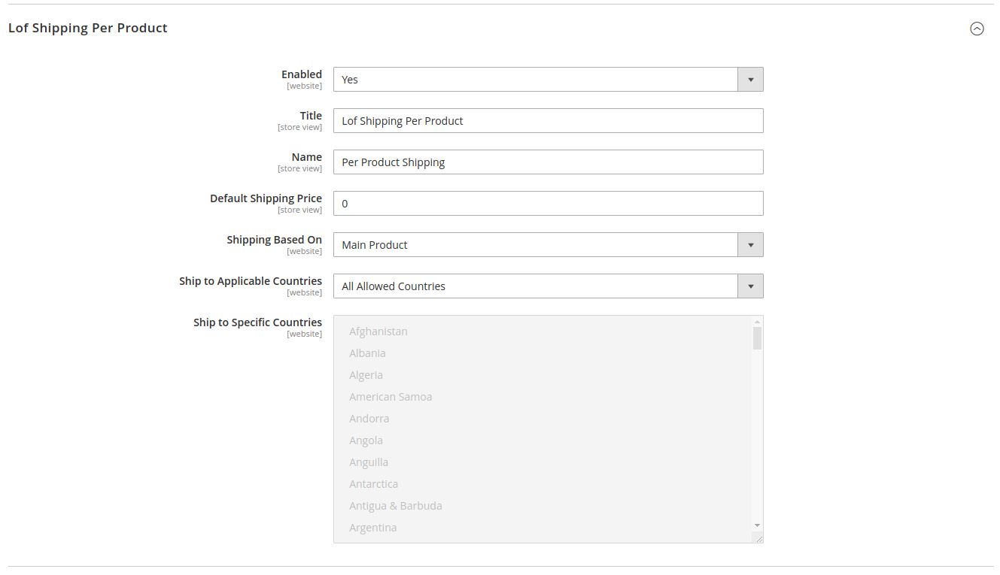
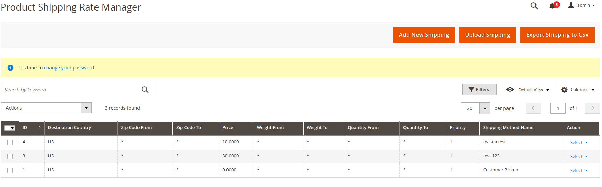
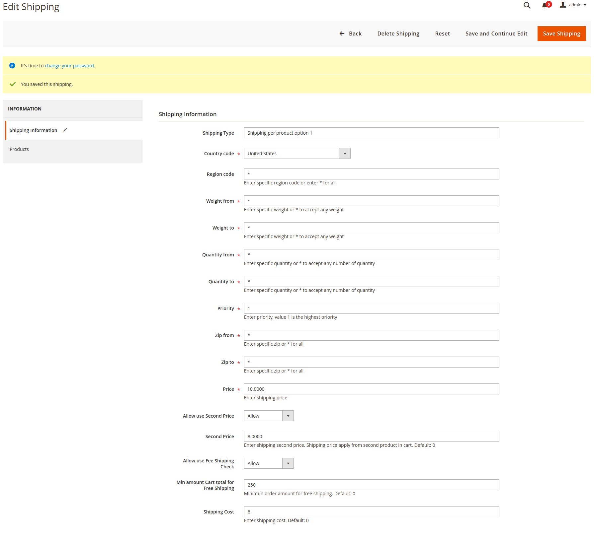
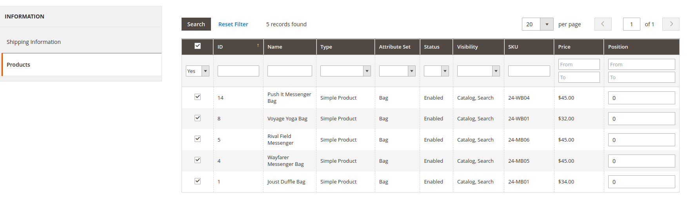
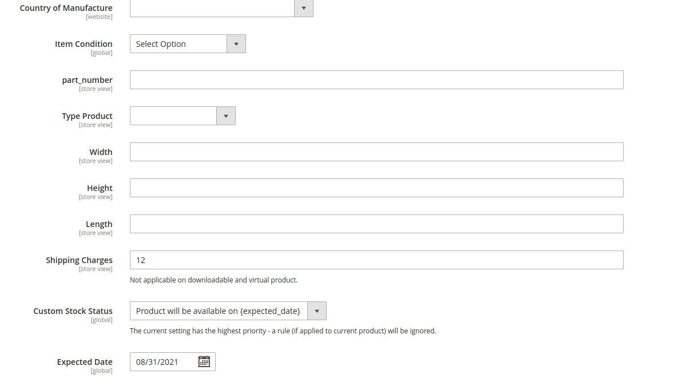
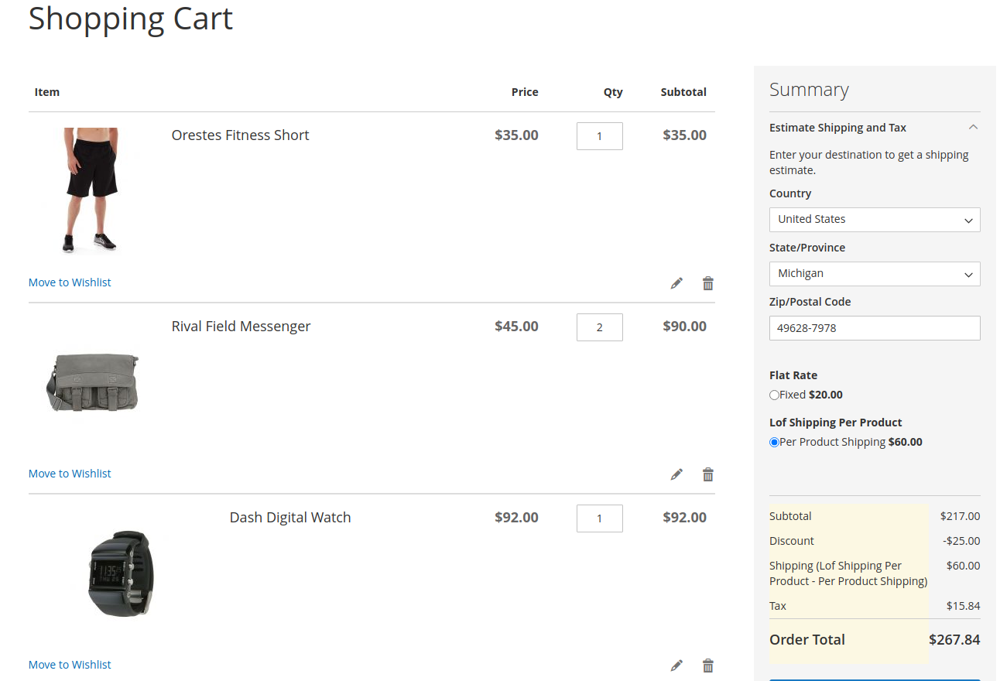
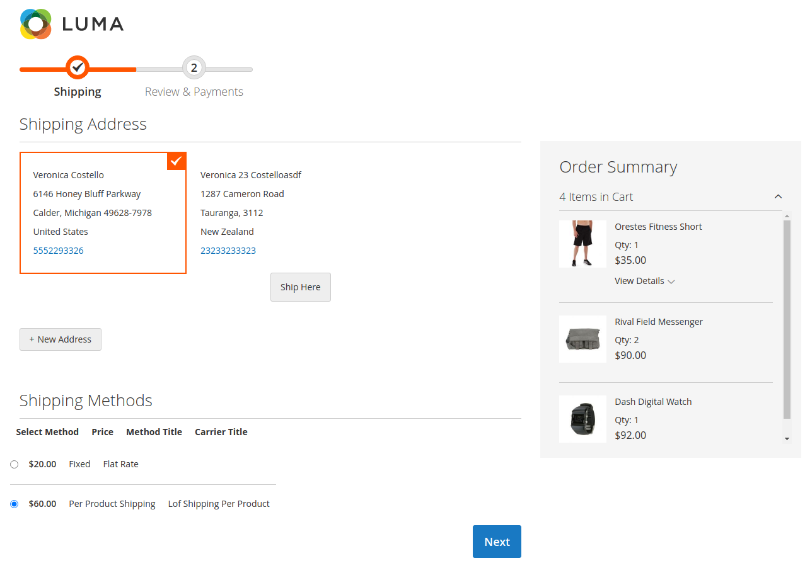

# Magento 2 Shipping Per Product

Magento 2 Shipping Per Product helps your store with the problem of incorrect shipping rate and allows your store to establish an additional shipping method to further service the customers.

Specifically, the Magento 2 store owners can set individual flat shipping rates for the items being delivered despite the item being heavy, light, or fragile.

## Main Features
- Flexible Shipping Rate For Specified Product
- Automatically Use Default Shipping Price For All Products FEATURED
- Wonderful Shipping Per Country Per Product
- Multiple Countries Shipping Allowance
- Easily Enable/Disable “Shipping Per Product”
- Useful Calculating Total Shipping Ordering FEATURED
- Exact & Detailed Shipping Address
- Easy Adding and Customizing Attributes
- Fast Optional Payment Method
- Excellence Settings Zip code, State for Per Product Shipping
- Easily Set Weight & Quantity Per Product for Shipping

## Installation

Upload Zip file via FTP to server then run magento 2 commands:

- Unzip the zip file in `app/code/Lof`
- Enable the module by running `php bin/magento module:enable Lof_ProductShipping`
- Apply database updates by running `php bin/magento setup:upgrade`\*
- Flush the cache by running `php bin/magento cache:flush`

## Configuration and Usage

1. Configuration
- Go to admin > Stores > Configuration > Sales > Delivery Methods > Edit method "Lof Shipping Per Product"

2. Manage Shipping Rates
- Go to admin > Landofcoder > Product Shipping > Product Shipping Rate

- Create new shipping rate:

- Choose products for shipping rate:

Also can add manually shipping charges in each product by add value for field "Shipping Charge" when edit product in backend:

## Result on frontend:

